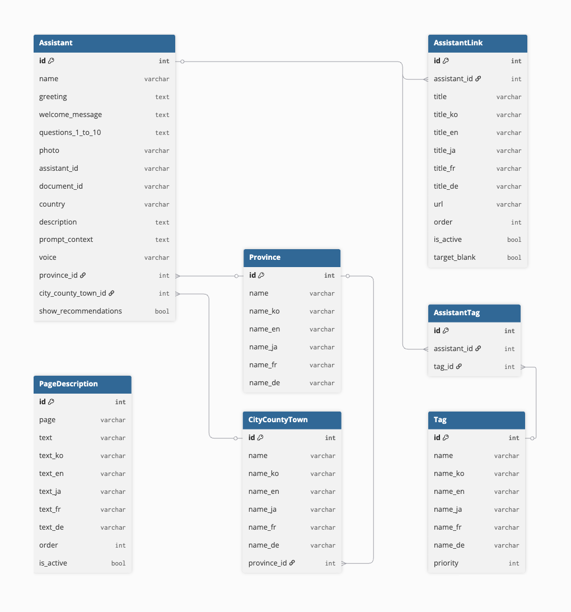
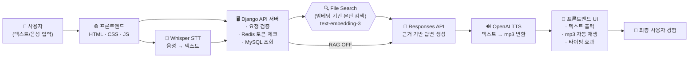

## Andong Cultural AI Chatbot 챗봇

지역 문화와 관광을 AI로 연결하는 다국어 챗봇 서비스

**Django · DRF · OpenAI Responses API · Whisper STT · TTS · i18n · MySQL · Redis**

---

## 🧭 Project Background – 기술로 사람과 문화를 연결하다

저는 기술이 단순한 기능 구현이 아니라 **사람과 소통하는 새로운 언어**라고 믿습니다.

소프트웨어융합학과에서 포토샵·일러스트·프리미어·CAD부터 Python·Java·C 등 다양한 소프트웨어를 배우며,

> “코딩은 사용자와 상호작용하는 새로운 미디어 형태의 의사소통이다.”
> 

라는 생각을 가지고 있었습니다.


그러던 어느 날, 교육공학과 친구와 밥먹으면서 나눈

> “AI로 교육과 문화를 연결해보면 어떨까?"
>

라는 대화가 계기가 되어 이 프로젝트가 시작되었습니다.

그 아이디어는 이후 친구가 **대통령 인재상**을 수상하는 계기가 되었고, 저는 그 비전을 실제 서비스로 구현하기 위한 기술 파트너로 합류했습니다.

---

## **🚀 대학생 사이드 프로젝트가 실제 사업이 되기까지**

대학 3학년 때 첫 프로토타이핑을 시작했습니다.

책에서 배우던 코드와 실제 서비스 개발은 완전히 달랐고, 현실에서는 **개발·배포·비용·마케팅·오류 대응** 모든 것이 큰 장벽이었습니다.

특히 프로젝트 초기에는 Django 백엔드, 프론트엔드, OpenAI 연동, Whisper/TTS, 다국어, 서버 배포까지 **모든 기능을 혼자 구현해야 했으며**, 수많은 시행착오를 겪으며 서비스를 완성해 나갔습니다.

친구는 실제 서비스로 출시하기 위해 **개인사업자 등록을 직접 진행**했고, 해당 프로젝트를 기반으로 **정식 회사를 설립**했습니다.

이후 4학년이 되던 해, 출시 이후 직접 창업박람회(한국, 일본), 기관·축제·지자체에 영업을 뛰고 서비스 제안과 데모 시연, 유지보수까지 책임졌고, 안동 지역에서 1년 이상 실제 관광객 대상으로 운영되었습니다. 

또한 4학년 때 졸업작품 전시회에서 해당 프로젝트를 발표하다 안동지역의 소상공인조합을 이끄는 분께서 유심히 보시고 지역의 소상공인들을 위한 홍보 챗봇은 어떠냐고 하시며 명함과 사업적 로드맵을 제안해 주셨습니다. 

결과적으로  다양한 마케팅으로 홍보가 되어 **월 평균 200~300만 원 규모의 유료 서비스 매출을 기록하며 실제 수익이 발생하는 서비스**로 성장했습니다.

---

## 🌍 주요 성과 및 활용

안동 지역의 문화유산·관광·전통주·독립운동 정보를 AI가 **5개국어로 안내하는 챗봇 서비스**입니다.

### ✔ 주요 활용 사례

- 안동시 **문화관광과 지원으로 외국인 여행객 대상 실서비스 운영**
- **탈춤축제 등 지역축제** 기간 전통주, 전통식당 홍보 기능 제공
- 챗봇 세계관 확장시켜 독립운동+보드게임 **와디즈 113% 펀딩 성공**
- 프로젝트 기반 콘텐츠(독립운동+보드게임) **교육부 장관상 수상**
- 이후 **투자 유치 및 고도화 진행 중**

---

## 🧩 구현된 기능

| 기능 | 설명 |
| --- | --- |
| 🗺️ 지역 선택 UI | 시/도 → 시·군·구 선택 후 어시스턴트 매칭 |
| 🧠 AI 챗봇 | OpenAI Responses API 기반 문화 안내 |
| 🔍 File Search | 벡터 기반 문서 검색(RAG)으로 근거 기반 답변 제공 |
| 🎤 Whisper STT | 웹 음성 녹음 → Whisper-1 전송 |
| 🗣️ OpenAI TTS | assistant.voice 기반 음성 출력 |
| 🌐 5개국어 | 한/영/일/프/독 지원 |
| 🔖 태그 추천 | 문화·전통주·독립운동 기반 추천 |
| 🧭 프리뷰 페이지 | 사진·설명·연관 어시스턴트 제공 |
| 🛠 관리자(Admin) | 지역/태그/어시스턴트 관리 |
| 🔐 Redis Token Limit | IP 기반 하루 토큰 제한 |

---

## 📂 프로젝트 구조도

```
culture_chatbot/
├─ manage.py
├─ culture_chatbot/
│  ├─ settings.py
│  ├─ urls.py
│  └─ ...
├─ assistant/
│  ├─ models.py
│  ├─ views.py
│	 ├─ urls.py
│  ├─ api_urls.py
│  ├─ utils.py
│  ├─ serializers.py
│  ├─ translation.py
│  └─ admin.py
├─ templates/
├─ static/
├─ locale/
├─ media/
├─ data/
└─ requirements.txt
```

## 🛠 기술 스텍

| **Category** | **Technologies** |
| --- | --- |
| **Backend** | Django 4.2 · DRF · MySQL · Redis · django-modeltranslation · python-dotenv · Gunicorn · Nginx |
| **AI** | OpenAI Responses API · File Search(RAG) · Whisper STT · OpenAI TTS |
| **Frontend** | Django Template · HTML/CSS/JS · Swiper.js · Django i18n · jsi18n |
| **Infra** | Vultr Ubuntu Server · Nginx Reverse Proxy · HTTPS(Certbot) · .env 기반 운영 |

## 🏗 **프로젝트 URL & API 구조**

> 이 프로젝트는 **페이지 라우팅과 API 라우팅을 명확하게 분리하고**
> 
> 
> i18n(다국어 URL) + **OpenAI 기반 챗봇 API를 함께 사용하는 구조로 설계**
> 

📍 페이지 URL 목록 (**사용자에게 보여지는 페이지는 모두 **다국어 지원(i18n)** 을 기반으로 라우팅)

| **URL** | **설명** |
| --- | --- |
| / | 메인 페이지 (지역 선택 진입점) |
| /local/ | 지역 선택 UI |
| /thema/ | 테마 기반 카테고리 페이지 |
| /independence/ | 독립운동 인물/역사 콘텐츠 |
| /sommelier/ | 전통주 소믈리에 페이지 |
| /search/ | 검색 결과 페이지 |
| /chatbot_preview/<id>/ | 어시스턴트 상세 & 프리뷰 |
| /chatbot/<id>/ | 실제 AI 챗봇 대화 페이지 |

📌 Assistant API (**페이지와 다르게, API는 **언어와 무관한 고정 URL)**

| **Endpoint** | **Method** | **Description** |
| --- | --- | --- |
| /api/assistant/list/ | GET | 지역/카테고리 기반 어시스턴트 목록 조회 |
| /api/assistant/chatbot/<id>/ | POST | 챗봇 대화 (OpenAI Responses + RAG) |
| /api/assistant/stt/ | POST | Whisper STT (음성→텍스트) |
| /api/assistant/tts/ | POST | OpenAI TTS (텍스트→음성) |

## 🔧 데이터 구조


※ 다국어는 django-modeltranslation을 사용하며, Assistant의 name, greeting, welcome_message, question_1~10 필드에 대해 ko/en/ja/fr/de 5개 언어 필드가 자동 확장.

---

## 🧪 시스템 흐름도



## 🧪 마주한 위기와 해결

| 구분 | 문제 | 해결 | 결과 |
|------|------|------|------|
| 🛠 **1. 다국어 시스템<br> (i18n + modeltranslation) 충돌 해결** | • 정적 번역(i18n)과 DB 번역(modeltranslation)이 서로 다른 기준으로 작동<br>• URL 언어 **프리픽스(/en/, /ja/)** 와 DB 필드 언어 불일치<br>• 일부 페이지에서 UI 언어와 DB 데이터 언어가 섞여 **출력되는 문제 발생** | • 언어 프리픽스를 기준으로 DB 언어 필드를 **자동 매핑하는 로직 구현**<br>• i18n.js + Django i18n + modeltranslation을 **하나의 언어 파이프라인으로 통합**<br>• 캐싱된 모델 데이터를 **언어별로 분리**하여 반환하도록 API 구조 개선 | • UI와 DB 데이터가 **5개국어에서 완전 동기화**<br>• 언어 전환 시 페이지 전체가 **즉시 갱신** |
| 🎤 **2. Whisper STT + TTS<br> 동시 사용 시 오디오 피드백 루프 문제** | • TTS가 출력한 음성이 STT 입력으로 다시 들어가는 **피드백 루프 발생**<br>• 녹음 중 음성 출력 시 **중복 응답 또는 무한 응답 발생** | • `isSpeaking`, `isRecording` 상태 기반의 **상태 머신(State Machine) 설계**<br>• STT 시작 시 TTS **음소거 처리**<br>• debounce + request lock으로 **race condition 제거** | • 음성 기반 대화 **안정화**<br>• **중복 응답률 0% 달성** |
| 🔍 **3. File Search(RAG)<br> 품질 편차 및 불필요한 벡터 검색 문제** | • `document_id` 없는 Assistant도 RAG 쿼리가 실행되어 **엉뚱한 문단 검색**<br>• 유사 키워드가 많은 문화/전통주 데이터에서 **매칭 정확도 흔들림** | • Assistant별 **RAG ON/OFF 플래그 도입**<br>• `document_id` 없을 때 벡터 검색 완전 비활성화<br>• “키워드 검색 + 임베딩 검색”의 **하이브리드 구조**로 품질 보정<br>• Responses API **프롬프트에 근거 문단 구조화하여 삽입** | • 근거 기반 답변 품질 **상승**<br>• 불필요한 벡터 검색 제거로 **응답 속도 개선** |
| ⚙️ **4. 서버 배포(Nginx + Gunicorn) 안정화 과정** | • 초기 Gunicorn 서비스 권한 문제로 반복 종료<br>• 정적 파일 경로 mismatch로 이미지 **404 빈번**<br>• CORS / ALLOWED_HOSTS 설정 오류로 API 호출 실패 발생<br>• 외부 MySQL 연결 충돌 | • systemd 환경변수 정비 → Gunicorn 안정화<br>• Nginx 정적 루트 경로 통일<br>• HTTPS(Certbot) 인증 + 자동갱신 설정<br>• MySQL 외부 커넥션 구조 분리 및 환경변수화 | • **1년 이상 무중단 운영**<br>• 실제 트래픽 증가 상황에서도 **안정성 유지** |
| 🌐 **5. 지역 기반 동적 로딩(Province → City) 다국어 처리 문제** | • AJAX로 로드된 지역 데이터가 **UI 언어와 불일치**<br>• modeltranslation과 JS i18n 충돌 | • 지역 데이터를 locale 기반으로 자동 변환하는 **middleware 구현**<br>• 지역 캐싱 구조를 **언어별로 분리** | • 지역 선택 UI **언어 일관성 100%** |
| 💬 **6. 대화 UI/UX 개선 (자동 스크롤, 액션버튼, 프리뷰)** | • 긴 응답에서 **자동 스크롤 미작동**<br>• 모바일 화면에서 액션 버튼이 콘텐츠를 가림<br>• 답변 후 액션 버튼(복사/좋아요/싫어요) **동적 생성 필요** | • IntersectionObserver 기반 **자동 스크롤**<br>• 프리뷰 페이지 추천 구역 ON/OFF 기능 추가<br>• `createActionButtons()`로 **동적 액션 버튼 생성** | • 자연스러운 사용자 경험 구현<br>• 실 서비스 수준 UX 완성 |

---

## 👨‍💻 My Role

- Django 백엔드 전체 설계 및 구현
- 프론트엔드 템플릿 및 UI 개발
- OpenAI Responses · Whisper STT · TTS 연동
- 다국어(i18n + modeltranslation) 구조 설계
- Nginx + Gunicorn 서버 배포
- Redis 기반 토큰 제한 시스템 구축
- 관리자 페이지 개발
- 데이터 구축(문화·독립운동·전통주 등)

---
